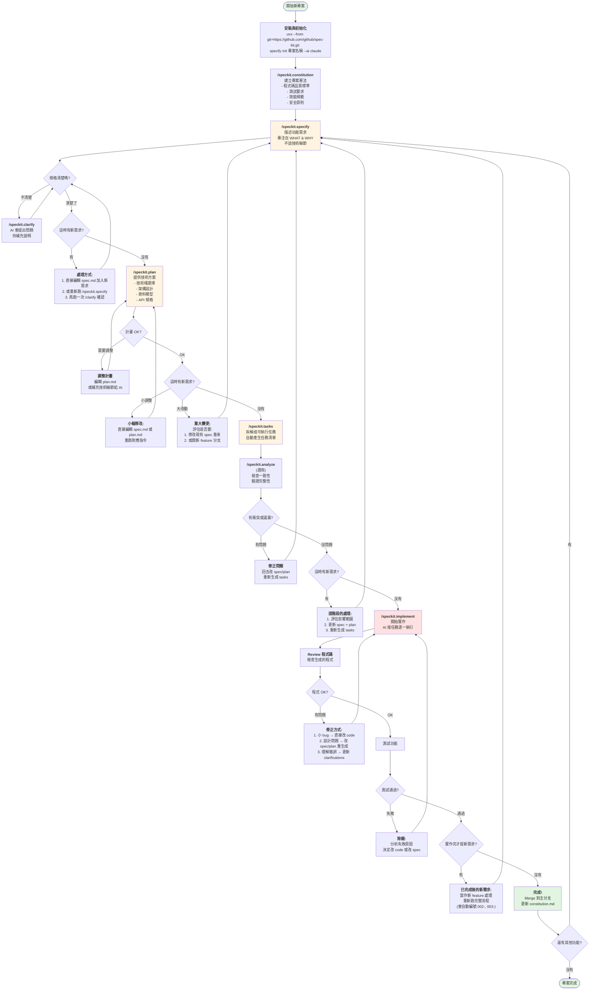
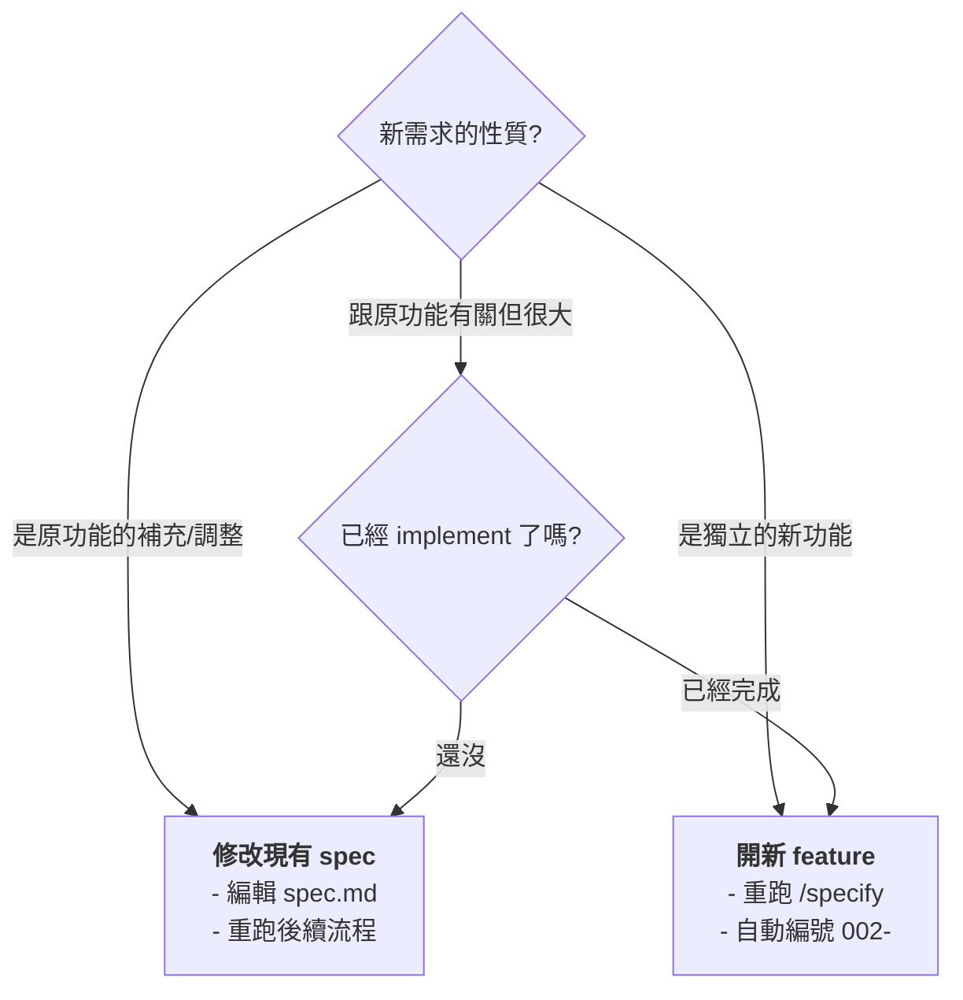

# Spec Kit 完整流程圖與情境處理

## 主要流程圖



## 情境處理速查表

### 情境 1: Specify 階段提出新需求
**時機:** 還在寫 spec，或剛跑完 `/speckit.specify`

**處理方式:**
```
選項 A (推薦): 直接補充
"我還要加一個功能: [新需求描述]
請更新 spec.md 整合進去"

選項 B: 手動編輯
1. 打開 specs/001-xxx/spec.md
2. 加入新需求段落
3. 請 AI 檢查整體一致性

選項 C: 重新描述
/speckit.specify
[完整描述舊需求 + 新需求]
```

**影響:** 最小，因為還沒做技術決策

---

### 情境 2: Plan 階段提出新需求
**時機:** 已經跑完 `/speckit.plan`，但還沒開始 implement

**處理方式:**
```
1. 先評估影響:
   - 新需求會改變技術選型嗎?
   - 需要新的 API 或資料結構嗎?

2. 小調整 → 直接改 plan.md
   "請根據這個新需求更新 plan.md 的 [相關章節]"

3. 大改動 → 回到 spec
   - 更新 spec.md
   - 重跑 /speckit.plan
   - 重新生成 tasks
```

**影響:** 中等，可能需要重新規劃架構

---

### 情境 3: Tasks 階段提出新需求
**時機:** 已拆好任務，準備要 implement

**處理方式:**
```
1. 評估影響範圍:
   "這個新需求會影響哪些現有任務?"

2. 小功能 → 新增任務
   - 在 tasks.md 加入新任務
   - 注意依賴關係

3. 中大型 → 回去改 spec/plan
   - 更新 spec.md + plan.md
   - 重跑 /speckit.tasks 重新拆解
```

**影響:** 較大，可能打亂任務順序

---

### 情境 4: Implement 階段發現需求不清楚
**時機:** 正在寫 code，發現 spec 沒說清楚

**處理方式:**
```
1. 暫停 implement

2. 回到 spec:
   "我在實作時發現 [某功能] 的行為沒定義清楚，
   具體來說 [描述情境]，應該怎麼處理?"

3. 更新 spec.md 的 clarifications

4. 視需要更新 plan.md

5. 繼續或重新 implement 該任務
```

**影響:** 中等，需要返工部分程式碼

---

### 情境 5: 已完成才提出新需求
**時機:** Feature 已經 merge 到 main，忽然要加新功能

**處理方式:**
```
1. 這就是新的 feature 了!

2. 重新開始流程:
   /speckit.specify
   [描述新需求]
   
3. 系統會自動編號 002-, 003-...

4. 新 spec 可以參考舊的:
   "請參考 001-xxx 的架構，
   這次要加入 [新功能]"

5. 重複完整流程
```

**影響:** 無，獨立的新功能

---

### 情境 6: 需求完全大改 (砍掉重練)
**時機:** 發現整個方向錯了

**處理方式:**
```
選項 A: 廢棄重來
1. 放棄當前 branch
2. 回到 main
3. 重新 /speckit.specify

選項 B: 保留歷史
1. 完成當前 spec (標記為 deprecated)
2. 開新 feature 寫新版本
3. 之後刪除舊的實作
```

**影響:** 最大，全部重來

---

## 關鍵決策點

### 該改現有 spec 還是開新 feature?



### 改 spec 要重跑到哪裡?

```
改了 spec.md → 重跑 /clarify + /plan + /tasks
改了 plan.md → 重跑 /tasks
改了 tasks.md → 直接 /implement
```

---

## 實戰建議

**在 Specify/Clarify 階段:**
- 多花時間把需求想清楚
- 主動問 AI "還有什麼我沒考慮到的?"
- 這階段改需求成本最低

**在 Plan 階段:**
- 確認技術方案能應付未來可能的擴充
- 問 AI "如果之後要加 [功能X]，這個架構能支援嗎?"

**在 Implement 階段:**
- 小調整直接改 code
- 發現設計問題要果斷回去改 spec/plan
- 不要硬著頭皮寫一堆 workaround

**每個 feature 完成後:**
- 更新 constitution.md
- 記錄學到的經驗
- 下次開發就能少踩坑
```

---

這個流程圖涵蓋了從初始化到完成的完整流程，以及在各個階段遇到需求變更時該怎麼處理。你可以把它當作參考手冊，遇到狀況就查對應的情境!